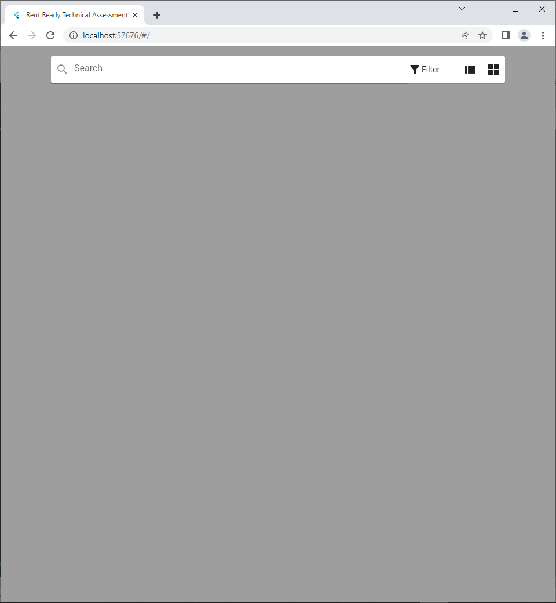

# Rent Ready Technical Assessment Project

This is a flutter mobile/web application project for Rent Ready technical assessment.

## Main Goals
- :white_check_mark: Create an application
- :white_check_mark: Implement search and filtering capabilities
- :white_check_mark: Implement a details view
- :white_check_mark: Utilize dataverse as a data storage (WebAPI)
- :white_check_mark: Load sample data into project

## :rocket: Flutter App
  ### State Management
- Provider (https://pub.dev/packages/provider)
  ### Packages Used 
    - :package:[provider: ^6.0.3](https://pub.dev/packages/provider)
    - :package:[collection: ^1.16.0](https://pub.dev/packages/collection)
    - :package:[flutter_spinkit: ^5.1.0](https://pub.dev/packages/flutter_spinkit)
    - :package:[http: ^0.13.3](https://pub.dev/packages/http)
    - :package:[auto_size_text: ^3.0.0](https://pub.dev/packages/auto_size_text)
    - :package:[page_transition: ^2.0.4](https://pub.dev/packages/page_transition)

## :rocket: Dataverse Link
 - UserName: huseyin@gozubenli.onmicrosoft.com 
 - https://org2906d5f0.crm4.dynamics.com
 
### Search Filter
 ```
 accounts?$select=accountid,accountnumber,name,statecode,statuscode,address1_stateorprovince,address2_stateorprovince&$top=100&$filter=contains(name,'" + text+ "') or contains(accountnumber,'" + text + "')"
```
## :rocket: Web Api
- I extended one of my existing Web Api projects for backend. 
- I created web api controller and service for querying. Demo web api project runs on [my demo domain](https://aplusapi.webapptr.com/)
- [Web Api Service](https://github.com/Gozubenli/WebApi/tree/master/WebApi/PowerApp/).
- [Web Api Controller](https://github.com/Gozubenli/WebApi/tree/master/WebApi/Controllers/PowerApp/).

## :rocket: Docker File
- [Dockerfile](https://github.com/Gozubenli/RentReadyAssessment/blob/master/Dockerfile/)
```
# Install Operating system and dependencies
FROM ubuntu:20.04
ARG DEBIAN_FRONTEND=noninteractive

RUN apt-get update 
RUN apt-get install -y curl git wget unzip libgconf-2-4 gdb libstdc++6 libglu1-mesa fonts-droid-fallback lib32stdc++6 python3 psmisc
RUN apt-get clean

# download Flutter SDK from Flutter Github repo
RUN git clone https://github.com/flutter/flutter.git /usr/local/flutter

# Set flutter environment path
ENV PATH="/usr/local/flutter/bin:/usr/local/flutter/bin/cache/dart-sdk/bin:${PATH}"

# Run flutter doctor
RUN flutter doctor

# Enable flutter web
RUN flutter channel master
RUN flutter upgrade
RUN flutter config --enable-web

# Copy files to container and build
RUN mkdir /app/
COPY . /app/
WORKDIR /app/

#Unit Test
RUN flutter test /app/test/accountsController_test.dart
#Component Test
RUN flutter test /app/test/widget_test.dart
#Build For Web
RUN flutter build web

# Record the exposed port
EXPOSE 5000

# make server startup script executable and start the web server
RUN ["chmod", "+x", "/app/server/server.sh"]

ENTRYPOINT [ "/app/server/server.sh"]
```
### Docker Commands
```
- docker build . -t flutter_docker
- docker run -i -p 8080:5000 -td flutter_docker
```

## :rocket: Tests
- Unit Test
```
- flutter test /app/test/accountsController_test.dart
```
- Component Test
```
- flutter test /app/test/widget_test.dart
```

## :rocket: Demo
